# PINYA-PIC v2.2 — Complete flowchart set (Supabase)

> User-facing app name: **PINYA-PIC** (repository folder may still be **PINE**).

**Diagram freshness (Apr 2026):** The flows below are the structural baseline. The live app also includes a **post-login navigation guide** (spotlight overlay on the dashboard, sequence steps, optional “show every time / once” preference), **dark-mode–aware** screens across camera/add-photo, disease content, fields, and profile, and a **post-scan “What to do next”** card on the detection result view. On-device detection uses **`assets/model/best.tflite`** with **Dart NMS** and default balanced thresholds documented in **`RUN.md`** §11.

## 1) User Authentication and Onboarding

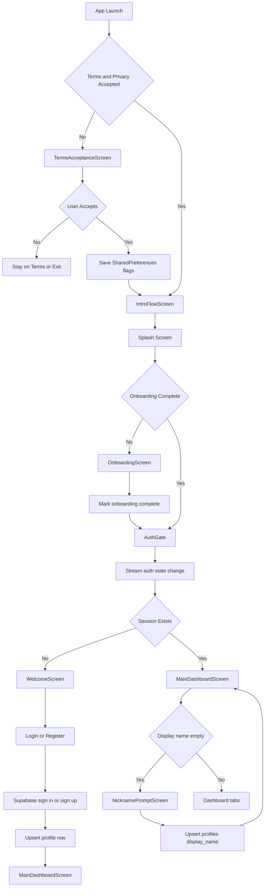

## 2) Camera and Detection Flow (Two Paths)

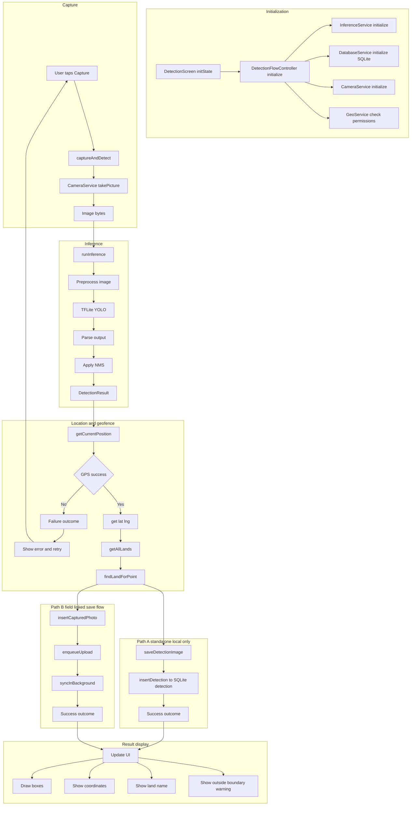

## 3) Offline Sync and Connectivity

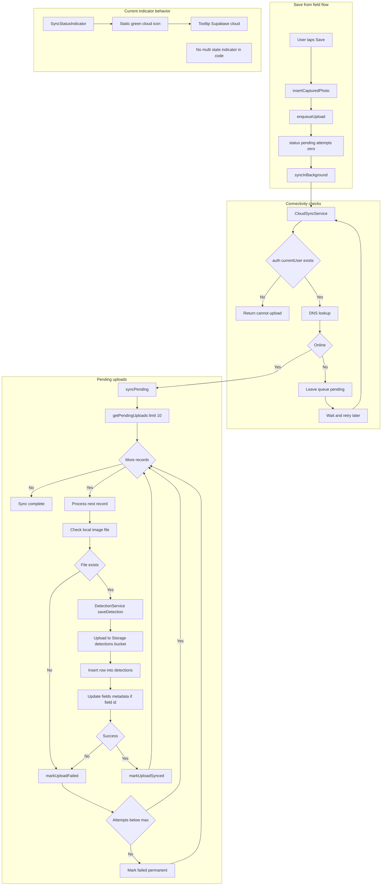

## 4) Dashboard Statistics Flow

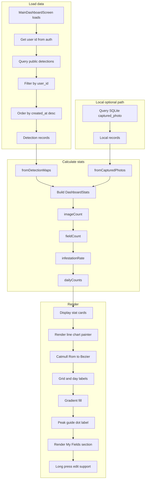

## 5) Field Management Flow

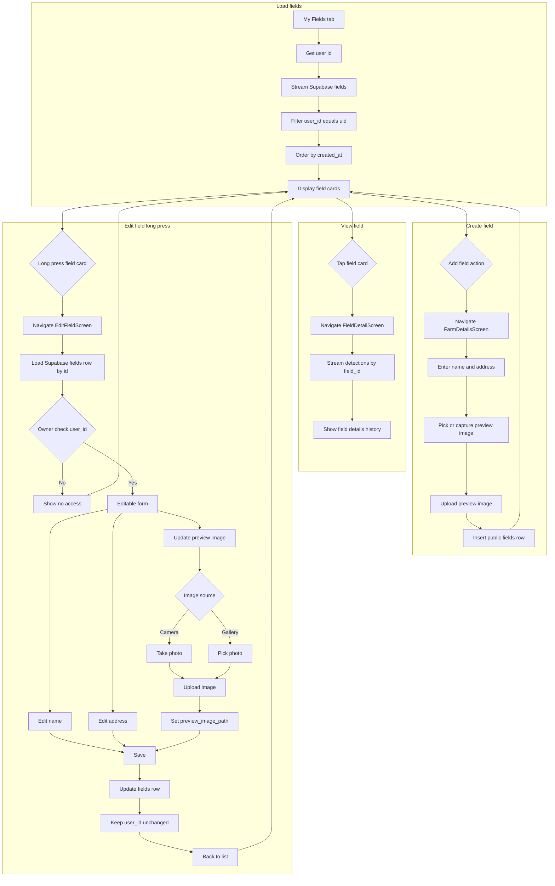

## 6) Entity Relationship Diagram

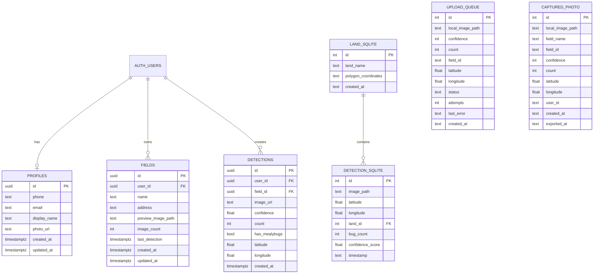

## 7) Service Dependency Graph

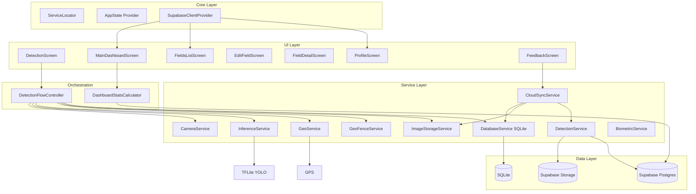

## 8) Sequence Diagram: Detection Flow

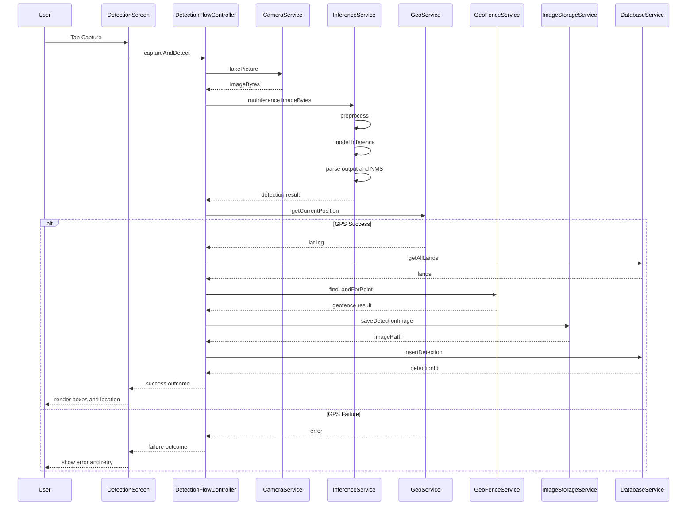

## 9) Sequence Diagram: Offline Sync

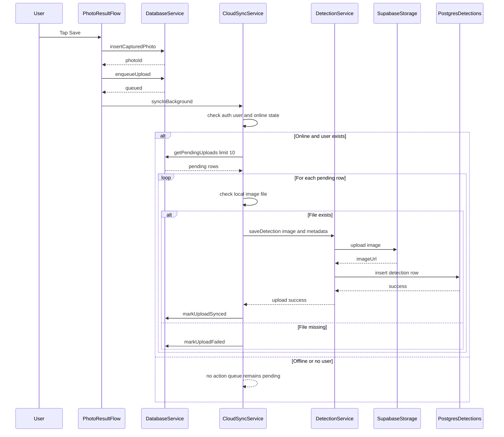

## 10) Deployment Diagram

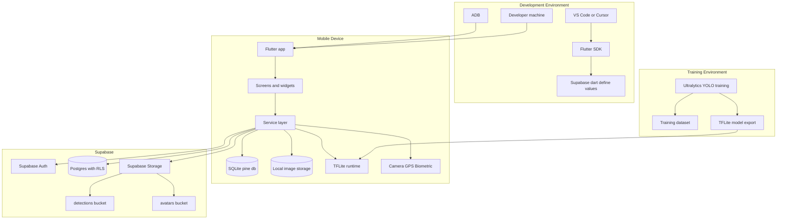

## 11) Component Architecture Diagram

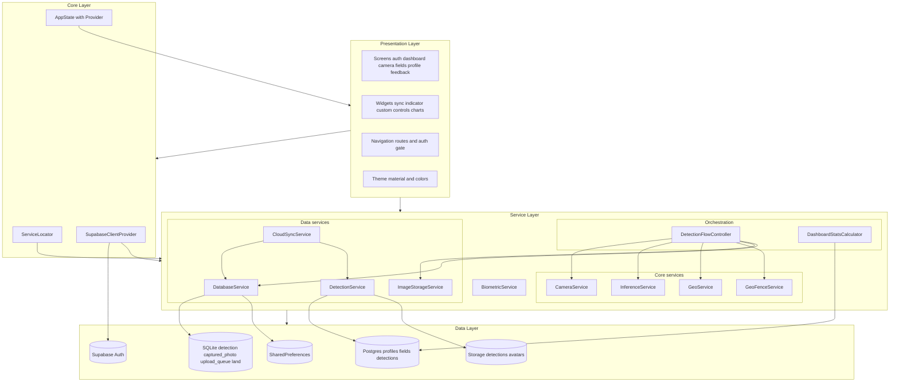

## 12) Feedback Flow

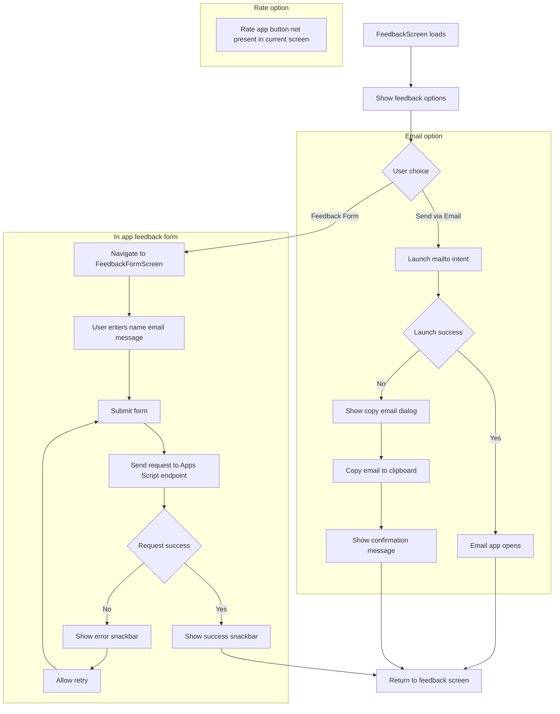

## 13) Profile Management Flow

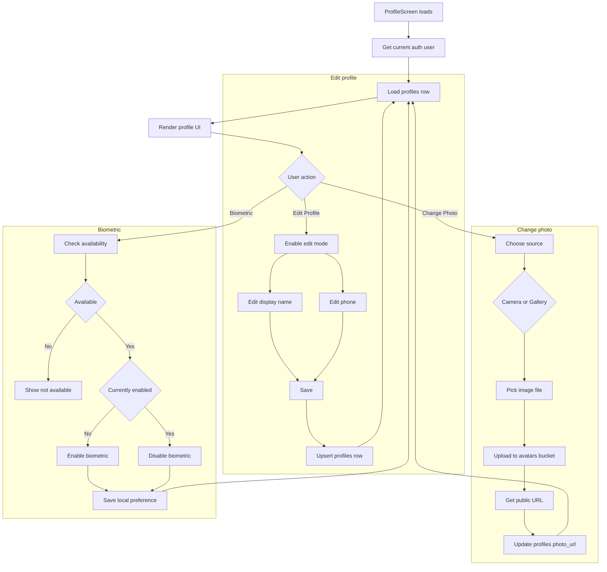

## 14) Chart Rendering Flow

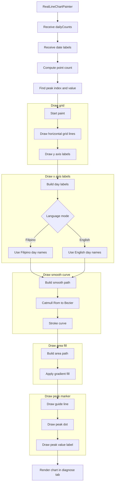
