# PINYA-PIC — Complete Diagram Pack (single shareable file)

**Date:** 13 June 2026  
**Project:** PINYA-PIC / PineSight — mealybug detection collector (mobile + admin web)  
**Format:** Mermaid blocks — paste into [Mermaid Live](https://mermaid.live), VS Code preview, GitHub, or export PNG for thesis.

---

## How to use this file

1. Share this **one `.md` file** with advisers or panel members.
2. Each section has a **Mermaid code block** — copy into Mermaid Live to export PNG/SVG.
3. For classic **UML use case ovals**, use [`use_case_diagram.puml`](use_case_diagram.puml) with PlantUML.
4. **B-series** IDs (B1–B12) map to Chapter III figure labels in [`PINYA_PIC_thesis_flowcharts.md`](PINYA_PIC_thesis_flowcharts.md).

---

## Chapter III disclaimer (paste verbatim)

> The diagrams presented are logical representations of the system workflows and architecture. Certain optional branches, asynchronous operations, and error-handling paths are described in detail in Sections 3.3–3.4 and are not fully expanded in the diagrams to maintain clarity.

---

## Table of contents

| # | Section |
|---|---------|
| B0 | [Use case diagram](#b0--use-case-diagram-june-2026) |
| B0t | [Thesis-style use case (APA 7)](#figure-1--use-case-diagram-apa-7) |
| B1 | [Diagnose tab data flow](#b1--diagnose-tab-data-loading) |
| B2 | [Seven-day chart pipeline](#b2--seven-day-chart-pipeline) |
| B3 | [App launch and auth](#b3--application-launch-and-auth) |
| B4 | [Capture and detection](#b4--image-capture-and-detection) |
| B5 | [Cloud sync queue](#b5--cloud-synchronization) |
| B6 | [Domain model / ERD](#b6--domain-model-erd) |
| B7 | [Component architecture](#b7--component-architecture) |
| B8 | [Three-layer architecture](#b8--three-layer-architecture) |
| B9 | [Field management](#b9--field-management) |
| B10 | [Feedback](#b10--feedback) |
| B11 | [Profile and preferences](#b11--profile) |
| B12 | [Deployment topology](#b12--deployment) |
| B13 | [Staff review and expert advice](#b13--staff-review-loop) |

---


## B0 — Use case diagram (June 2026)

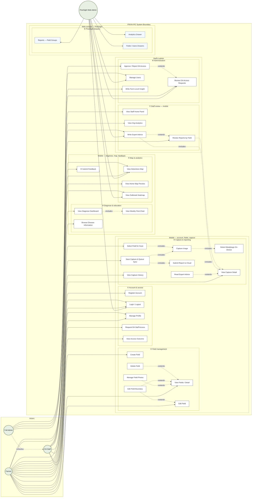


## B0b — Mobile admin vs web admin

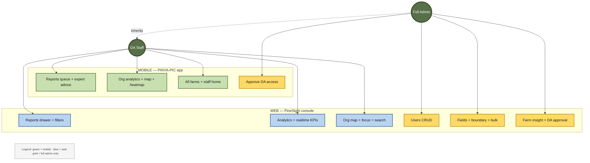

## Figure 1 — Use case diagram (APA 7)

**Figure 1**  
*Use Case Diagram of the PINYA-PIC Mealybug Collecting Mobile Application With Decision Middleware*

> Classic UML ovals: [`use_case_diagram_thesis.puml`](use_case_diagram_thesis.puml) + full APA block: [`FIGURE_1_USE_CASE_APA7.md`](FIGURE_1_USE_CASE_APA7.md)

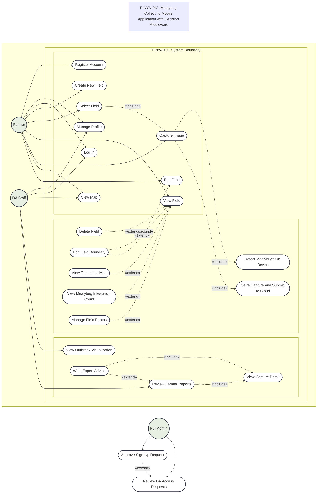

*Note.* Farmer (left), DA Staff (right), and Full Admin (bottom) match the thesis layout. Approve Sign-Up Request = DA staff access approval. Include/extend links reflect the June 2026 codebase.

## B1 — Diagnose tab data loading

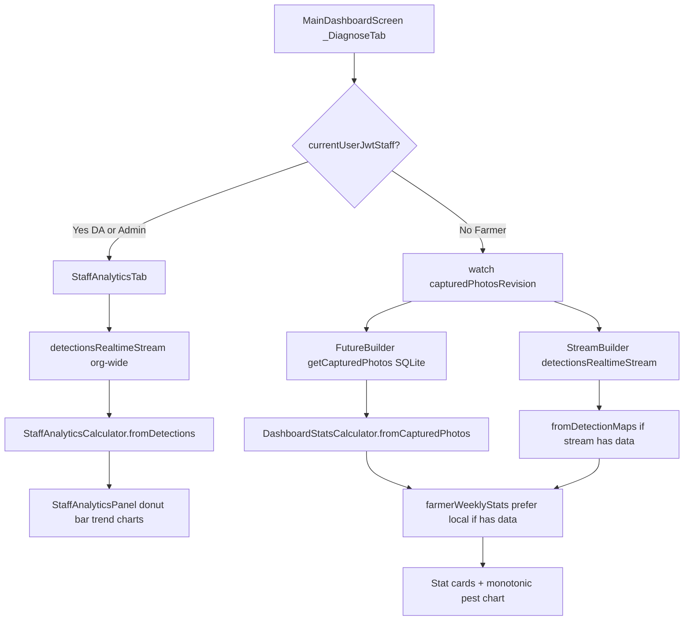

## B2 — Seven-day chart pipeline

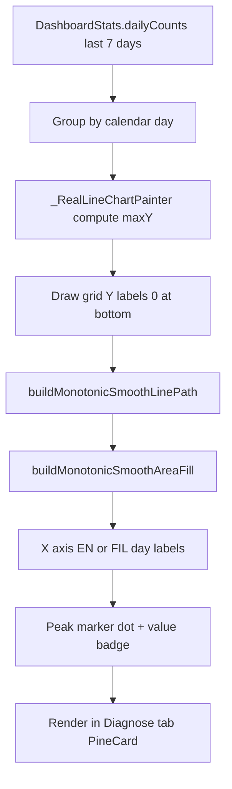


## B3 — Application launch and auth

```mermaid
flowchart TD
    A[App Launch main.dart] --> B{Supabase configured?}
    B -->|No| C[ConfigRequiredScreen]
    B -->|Yes| D[IntroFlowScreen route /]
    D --> E[SplashScreen ~650ms]
    E --> F{Inactive 14+ days?}
    F -->|Yes| G[resetOnboardingComplete + signOut]
    G --> H{Onboarding complete?}
    F -->|No| H
    H -->|No| I[OnboardingScreen 3 slides]
    I --> J[_AuthGate]
    H -->|Yes| J
    J --> K{Session exists?}
    K -->|No| L[WelcomeScreen]
    L --> M[Login or Register tap]
    M --> N[ensureTermsAccepted before auth]
    N --> O[LoginScreen / RegisterScreen email+password]
    O --> P[SupabaseProfileService.upsertCurrentUserProfile]
    P --> J
    K -->|Yes| Q[UnlockGate biometric optional]
    Q --> R[PostAuthGate staff onboarding if pending]
    R --> S[NavigationGuideHost]
    S --> T[MainDashboardScreen]
    T --> U{display_name empty?}
    U -->|Yes| V[/nickname-prompt pushed]
    U -->|No| W{JWT role center nav}
    W -->|Full admin| X[DaAccessRequestsScreen]
    W -->|DA staff| Y[AdminReportsScreen pendingReply]
    W -->|Farmer| Z[startFieldFirstScan]
```


## B4 — Image capture and detection

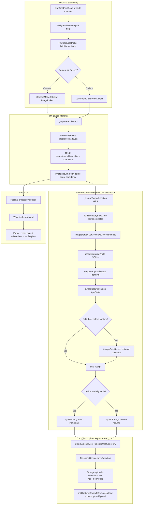


## B5 — Cloud synchronization

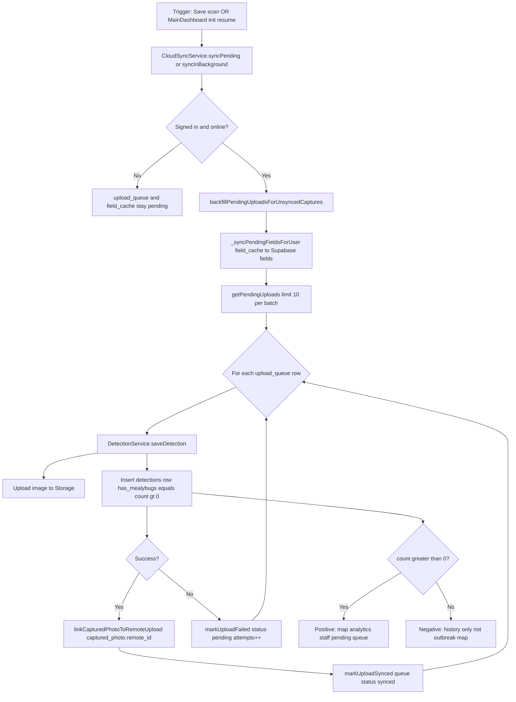


## B6 — Domain model (ERD)

```mermaid
erDiagram
    AUTH_USERS ||--o| PROFILES : has
    AUTH_USERS ||--o{ FIELDS : owns
    AUTH_USERS ||--o{ DETECTIONS : creates
    AUTH_USERS ||--o{ ACCESS_REQUEST : submits
    FIELDS ||--o{ DETECTIONS : contains
    FIELDS ||--o{ FARM_INSIGHTS : has
    DETECTIONS ||--o| EXPERT_RESPONSES : may_have
    CAPTURED_PHOTO ||--o| UPLOAD_QUEUE : linked_by_local_image_path
    FIELD_CACHE ||--o| FIELDS : mirrors_when_offline
    LAND ||--o| FIELDS : boundary_polygon_local

    PROFILES {
        uuid id PK
        text phone
        text email
        text display_name
        text photo_url
        text account_intent
        timestamptz created_at
        timestamptz updated_at
    }

    FIELDS {
        uuid id PK
        uuid user_id FK
        text name
        text address
        jsonb boundary_json
        text preview_image_path
        int image_count
        timestamptz last_detection
        timestamptz created_at
        timestamptz updated_at
    }

    DETECTIONS {
        uuid id PK
        uuid user_id FK
        uuid field_id FK
        text image_url
        float confidence
        int count
        bool has_mealybugs
        jsonb detections_json
        float latitude
        float longitude
        timestamptz created_at
    }

    EXPERT_RESPONSES {
        uuid id PK
        uuid detection_id FK UK
        uuid author_id FK
        text strategy_text
        text action_type
        timestamptz created_at
        timestamptz updated_at
    }

    FARM_INSIGHTS {
        uuid id PK
        uuid field_id FK
        uuid author_id FK
        text insight_text
        timestamptz created_at
    }

    ACCESS_REQUEST {
        uuid id PK
        uuid user_id FK
        text full_name
        text organization
        text company_location
        text position
        text note
        text status
        uuid reviewer_id FK
        text review_note
        timestamptz reviewed_at
    }

    CAPTURED_PHOTO {
        int id PK
        text local_image_path
        text field_id
        text field_name
        int count
        float confidence
        text user_id
        text remote_id
        text remote_image_url
        text detections_json
        float latitude
        float longitude
        text created_at
    }

    UPLOAD_QUEUE {
        int id PK
        text local_image_path
        text field_id
        float confidence
        int count
        float latitude
        float longitude
        text name_hint
        text status
        int attempts
        text last_error
        text created_at
    }

    FIELD_CACHE {
        text id PK
        text user_id
        text name
        text address
        text boundary_json
        text sync_status
    }

    LAND {
        int id PK
        text land_name
        text polygon_coordinates
    }
```


## B7 — Component architecture

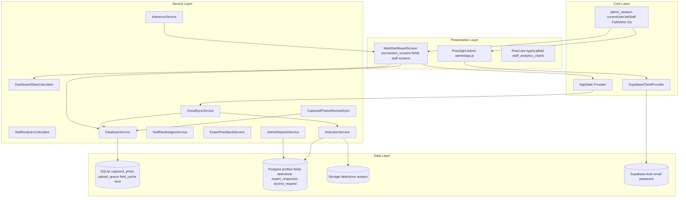

## B8 — Three-layer architecture

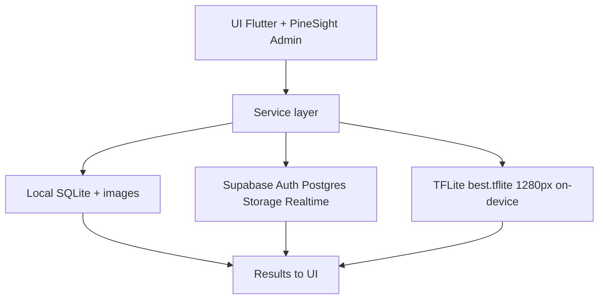


## B9 — Field management

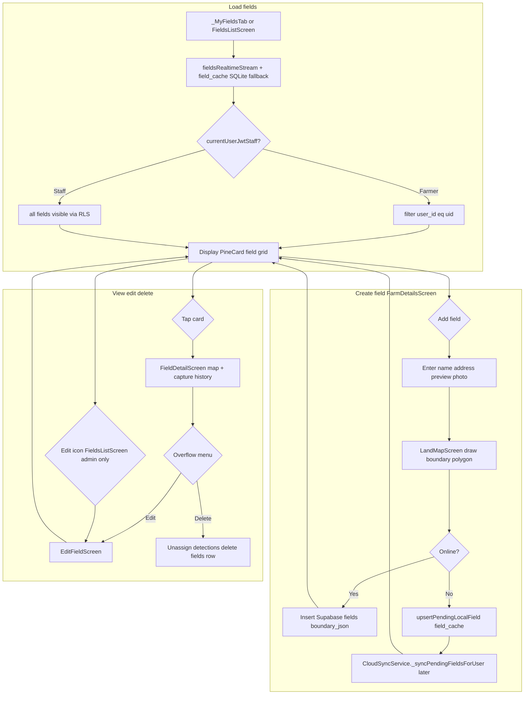


## B10 — Feedback

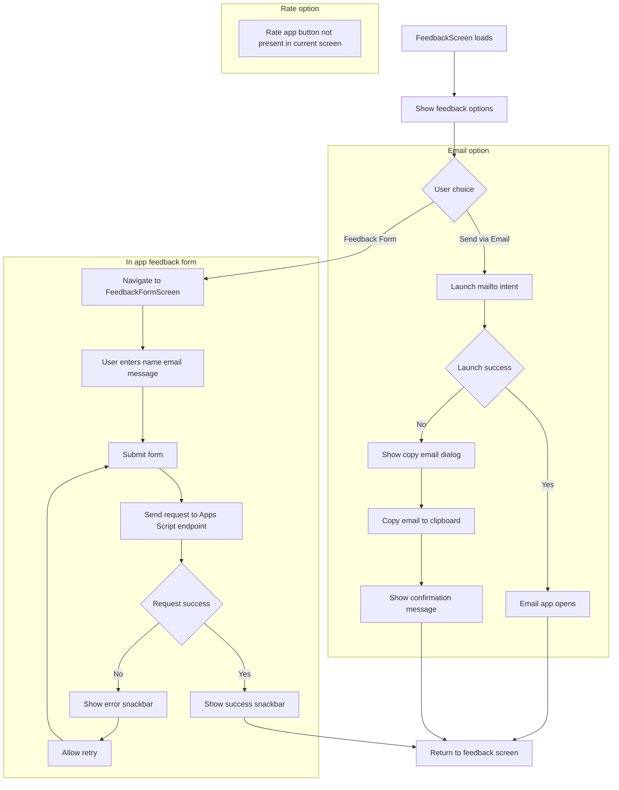


## B11 — Profile

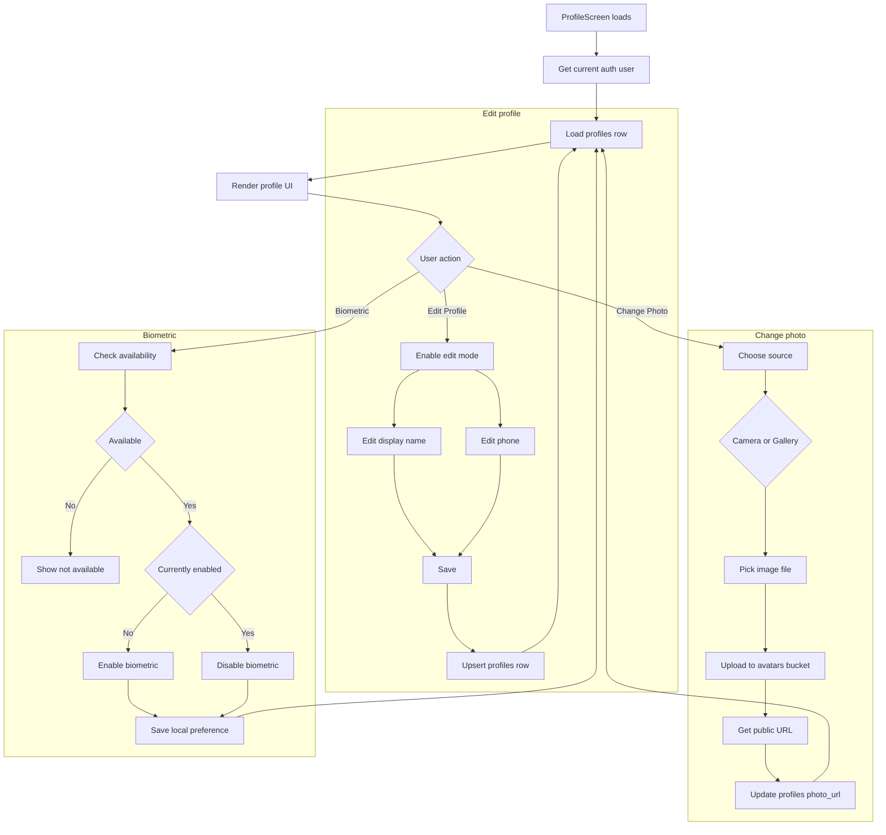


## B12 — Deployment

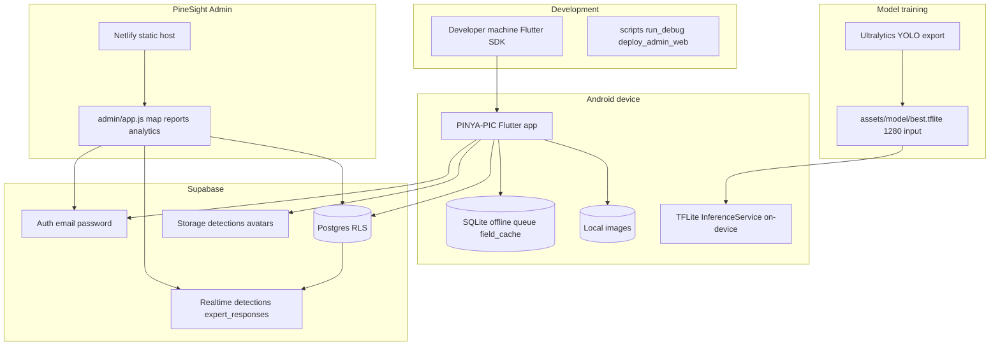


## B13 — Staff review loop

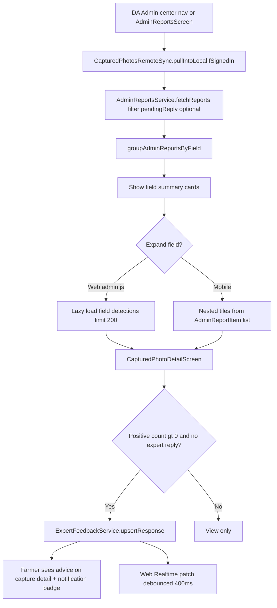


## Dashboard diagnose detail

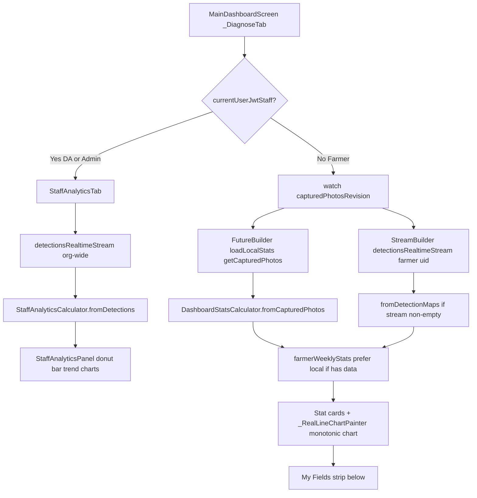


## Chart rendering detail


## Service dependencies

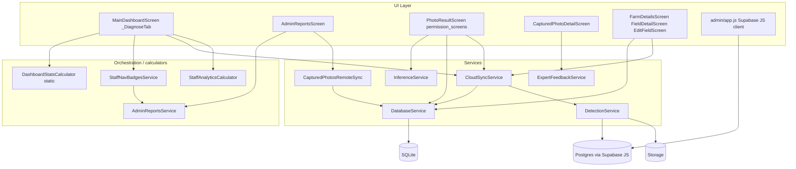


## Sequence: detection

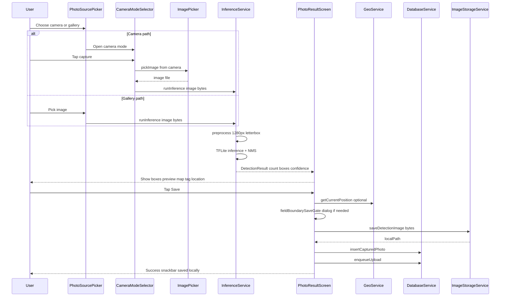


## Sequence: sync

```mermaid
sequenceDiagram
    participant User
    participant PRS as PhotoResultScreen
    participant DBS as DatabaseService
    participant AS as AppState
    participant CTS as CloudSyncService
    participant RDS as DetectionService
    participant ST as Supabase Storage
    participant PG as Postgres detections

    User->>PRS: Tap Save
    PRS->>DBS: insertCapturedPhoto
    PRS->>DBS: enqueueUpload
    PRS->>AS: bumpCapturedPhotos
    alt Online and signed in
        PRS->>CTS: syncPending limit 1
        CTS->>DBS: backfill + getPendingUploads
        CTS->>RDS: saveDetection from queue row
        RDS->>ST: upload image file
        RDS->>PG: insert detections has_mealybugs
        RDS-->>CTS: detection_id + image_url
        CTS->>DBS: linkCapturedPhotoToRemoteUpload
        CTS->>DBS: markUploadSynced
    else Offline or not signed in
        PRS->>CTS: syncInBackground
        Note over CTS,DBS: Retries on dashboard resume when online
    end
```


---

## Positive vs negative routing (panel rule)

| Detection result | count / has_mealybugs | Map & heatmap | Staff pending queue |
|------------------|----------------------|---------------|---------------------|
| **Positive** | count > 0 | Yes | Yes until advice saved |
| **Negative** | count = 0 | No | No |

---

*Last updated 13 June 2026. Source: `docs/diagrams/*.mmd`. Regenerate: `python scripts/combine_diagrams_md.py`*
