# PINYA-PIC — Thesis diagram pack (B-series) + Mermaid source

Official **B-series** labels for Chapter III figures, **inclusion policy**, and paste-ready **Mermaid** blocks aligned with `d:\old_PINE`.

---

## Chapter 3 — required disclaimer (paste verbatim)

Use this sentence in **Chapter III** (figure overview or methodology intro):

> The diagrams presented are logical representations of the system workflows and architecture. Certain optional branches, asynchronous operations, and error-handling paths are described in detail in Sections 3.3–3.4 and are not fully expanded in the diagrams to maintain clarity.

---

## B-series index (code ↔ thesis figure ID)

| ID | Title (for List of Figures) | Mermaid section below |
|----|-----------------------------|------------------------|
| **B1** | Diagnose Tab: Data Loading and Visualization Flow | § B1 |
| **B2** | Seven-Day Chart Processing Flow (sub-pipeline) | § B2 — *optional; omit if B1 suffices* |
| **B3** | Application Launch, Session, and User Initialization Flow | § B3 |
| **B4** | Image Capture and Detection Pipeline | § B4 |
| **B5** | Cloud Synchronization and Queue Processing Flow | § B5 *(primary)* |
| **B6** | Domain Model and Data Storage Relationships | § B6 |
| **B7** | Application Architecture: UI–State–Service Interaction Loop | § B7 |
| **B8** | High-Level System Architecture (Three-Layer Model) | § B8 |
| **B9** | Field Management Workflow | § B9 |
| **B10** | Feedback Submission Workflow | § B10 |
| **B11** | Profile Management and Preferences Flow | § B11 |
| **B12** | Deployment Topology (Mobile–Local–Cloud) | § B12 |
| **B14** | *Reserved* — assign to a non-Mermaid figure if needed (e.g. Gantt, ERD screenshot, deployment photo). No Mermaid block in this file. | — |

**Do not use in thesis:** the simplified B5 variant in § “B5 variant (not for thesis)” — it duplicates **B5** and weakens the panel story.

---

## What to include in the bound thesis (recommended)

**Core (must include):** B1, B3, B4, B5, B7, B9  

**Supporting (include if page budget / adviser asks):** B6, B10, B11, B12  

**Optional (only if needed):** B2 (if chart logic is discussed separately from B1), B8 (if adviser wants a layered view in addition to **B7** — prefer **B7** as the single primary architecture figure to avoid redundancy)

---

## Caption note for **B12** (required)

> This diagram represents **deployment topology** (where components live), not a single **runtime execution** path. On-device inference uses the TFLite asset from application code; SQLite does not “invoke” the model.

---

## B1 — Diagnose Tab: Data Loading and Visualization Flow

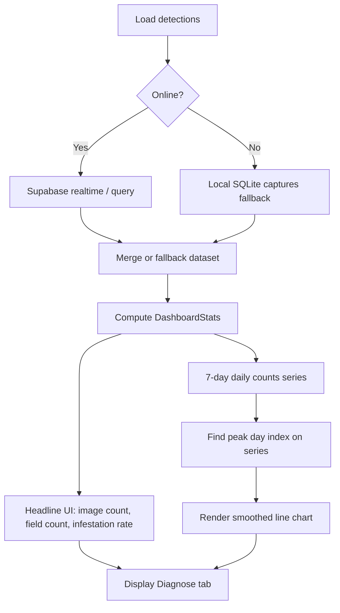

---

## B2 — Seven-Day Chart Processing Flow (sub-pipeline)

*Use only if you discuss chart construction separately; otherwise rely on **B1** only.*

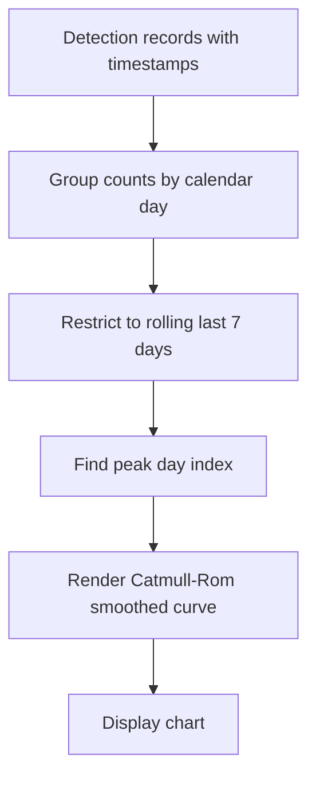

---

## B3 — Application Launch, Session, and User Initialization Flow

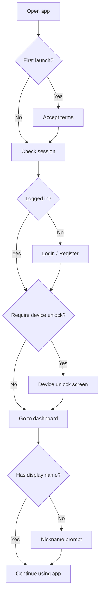

---

## B4 — Image Capture and Detection Pipeline

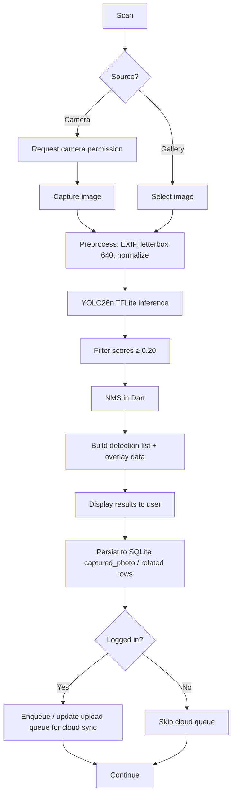

---

## B5 — Cloud Synchronization and Queue Processing Flow (PRIMARY)

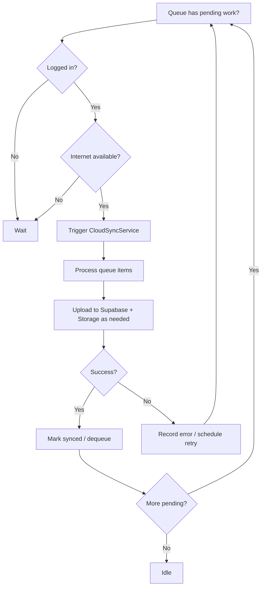

### B5 variant (not for thesis — duplicate of B5)

*Do not place in the manuscript; kept here for quick drafts only.*

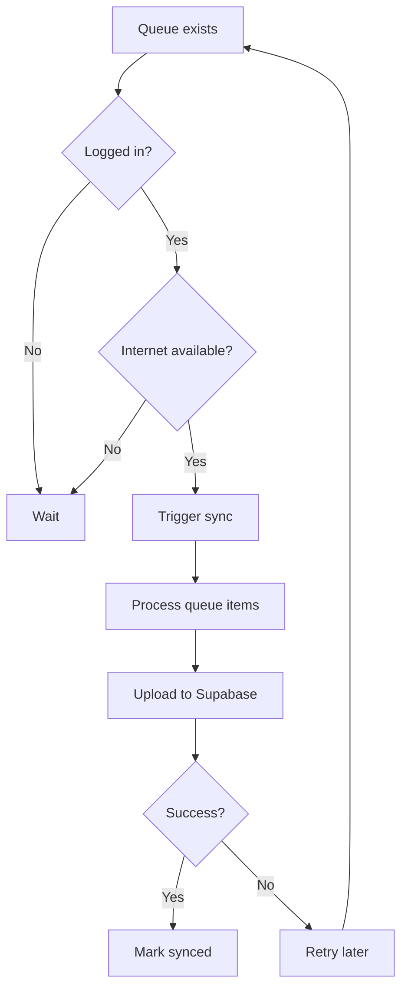

---

## B6 — Domain Model and Data Storage Relationships

*Logical **data placement** / persistence — not a single user click path.*

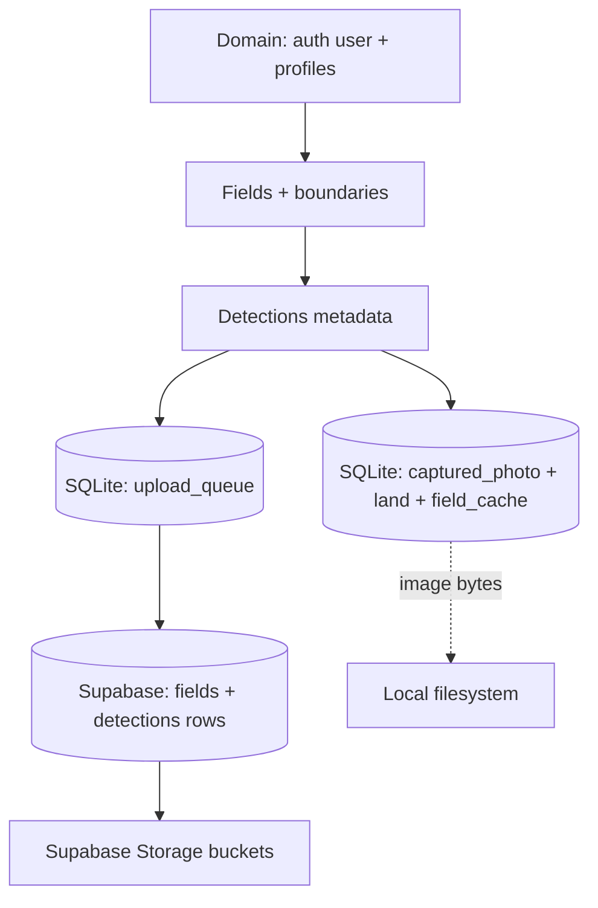

---

## B7 — Application Architecture: UI–State–Service Interaction Loop

*Recommended **primary** in-app architecture figure. Full stack (mobile + Supabase + ML pipeline): `docs/thesis/SYSTEM_ARCHITECTURE.md` §3.1.*

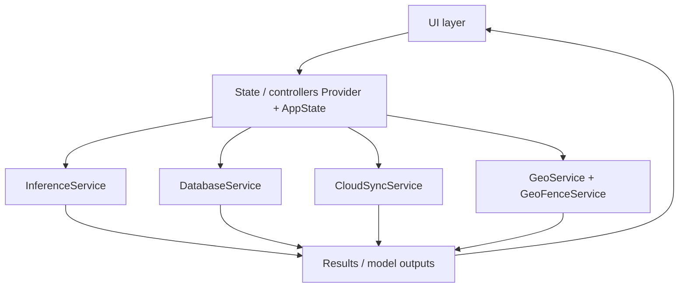

---

## B8 — High-Level System Architecture (Three-Layer Model)

*Use only if **B7** alone is insufficient; add `OUT --> UI` if you want an explicit return edge.*

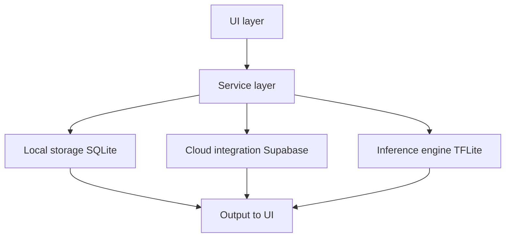

---

## B9 — Field Management Workflow

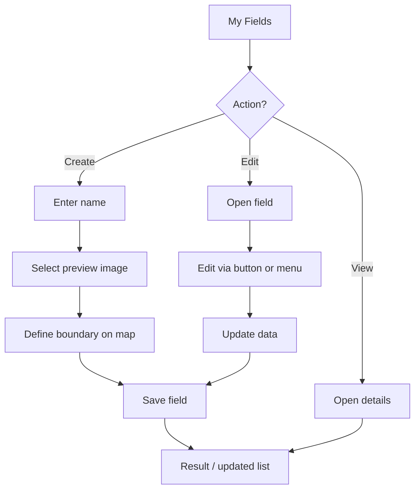

---

## B10 — Feedback Submission Workflow

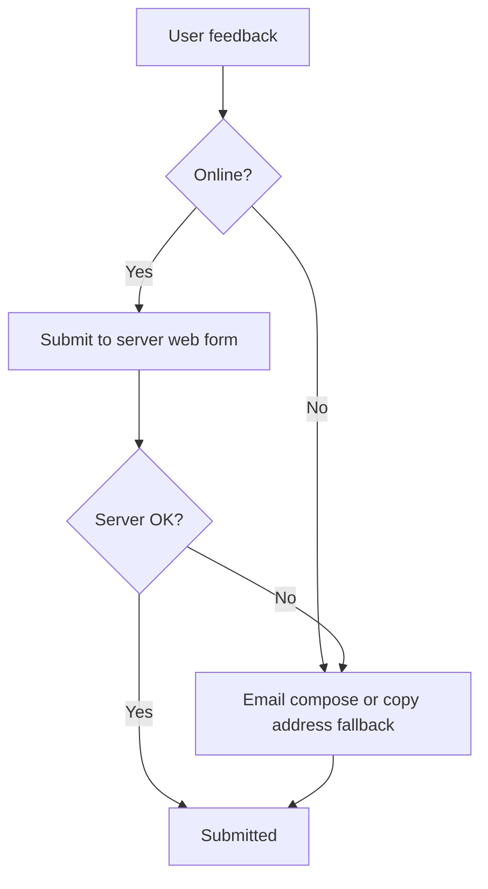

---

## B11 — Profile Management and Preferences Flow

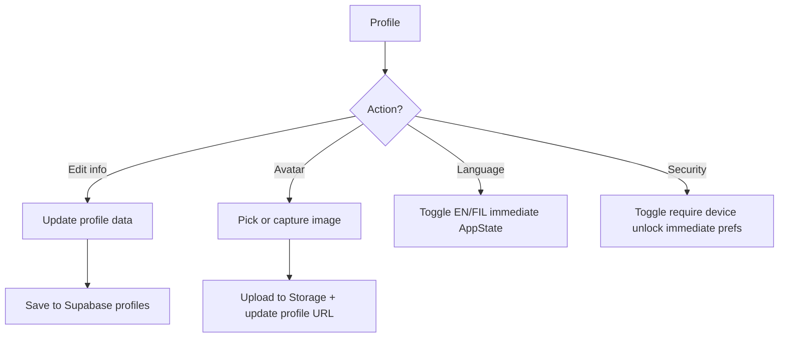

---

## B12 — Deployment Topology (Mobile–Local–Cloud)

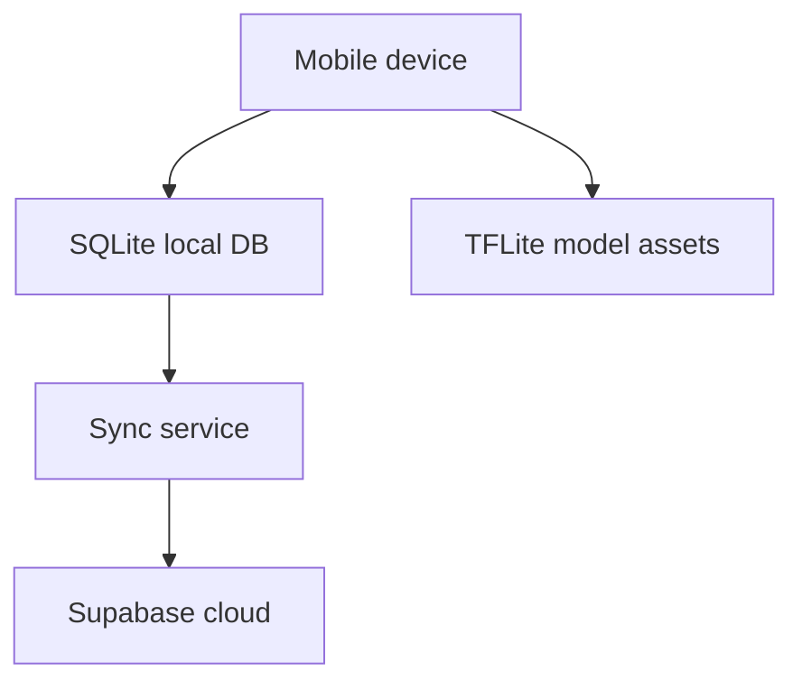

**Caption note:** TFLite runs from app code paths, not from the DB engine; this figure is **topology**, not a single call stack.

---

## B14 — reserved

Assign **B14** in the List of Figures to any **non-Mermaid** asset you already use (e.g. methodology Gantt, ERD, deployment screenshot). There is no Mermaid block for B14 in this repository file by default.

---

*When the app changes, update Mermaid here first, then re-export PNG/PDF for the thesis.*
