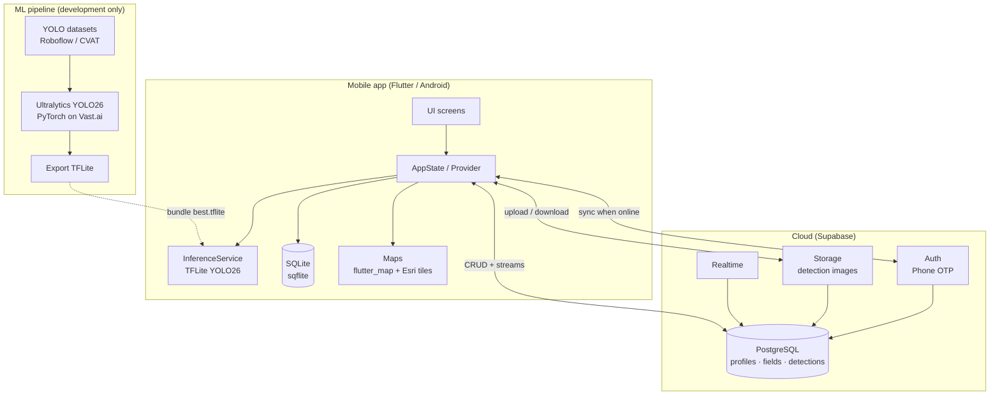
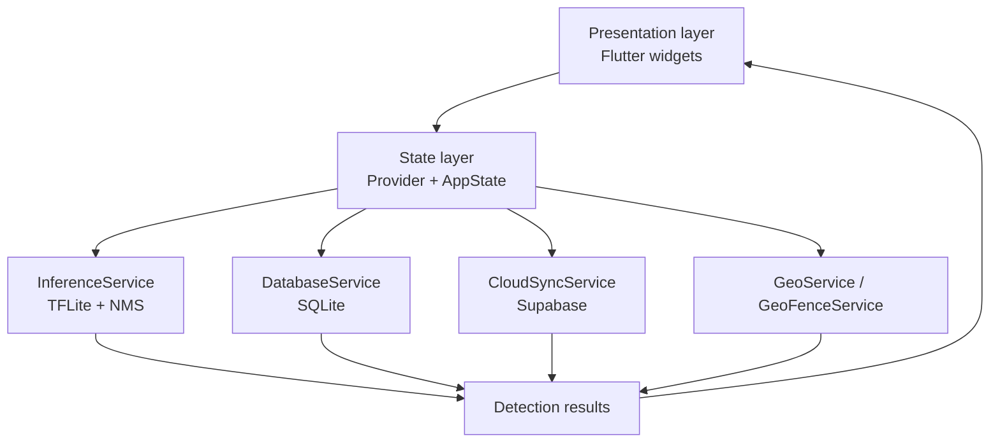
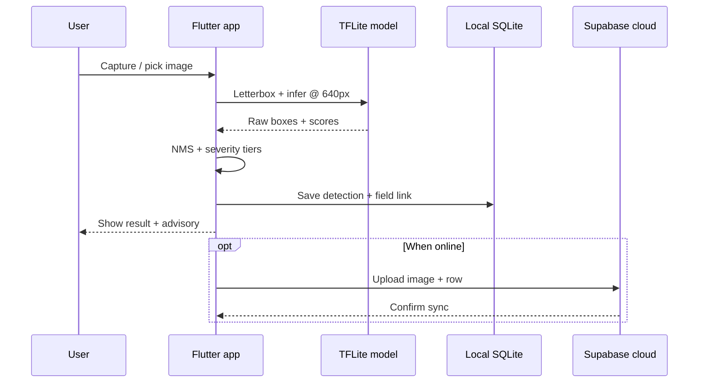
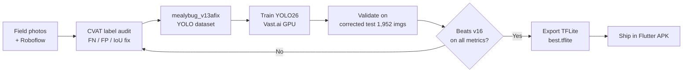

# PINYA-PIC — System Architecture & Technology Stack

*Thesis-ready reference. Covers the mobile app, cloud backend, and ML pipeline. **Admin web panel excluded.***

**Related figures:** `docs/diagrams/PINYA_PIC_thesis_flowcharts.md` (B7 app layers, B8 three-layer model)

---

## 1. Paste-ready summary (Chapter III / IV)

PINYA-PIC is implemented as an **offline-first Android mobile application** built with **Flutter (Dart)**. On-device mealybug detection uses a **YOLO26** detector exported to **TensorFlow Lite** and executed locally via `tflite_flutter`; inference does not require network connectivity. Field records, detection history, and map boundaries are stored locally in **SQLite** (`sqflite`) and may be synchronized to a **Supabase** backend when connectivity is available. Supabase provides **PostgreSQL** persistence, **phone-based authentication**, **object storage** for detection images, and **realtime** subscriptions. Maps use **flutter_map** with **Esri World Imagery** tiles and on-device tile caching for offline reuse. Model development runs on a separate **Python / Ultralytics / PyTorch** pipeline on cloud GPUs (**Vast.ai**), with datasets managed in **YOLO** format and labels reviewed in **CVAT** and **Roboflow**.

---

## 2. Technology stack

### 2.1 Mobile application

| Layer | Technology | Role |
|-------|------------|------|
| **Framework** | Flutter (Dart SDK ≥ 3.2) | Cross-platform UI; Android is the deployment target |
| **Platform** | Android (Kotlin, compileSdk 36) | Native shell, camera, permissions |
| **UI** | Material Design | Screens, navigation, theming |
| **State management** | Provider (`ChangeNotifier` / `AppState`) | App-wide and screen state |
| **On-device ML** | TensorFlow Lite (`tflite_flutter`) | Runs `best.tflite` without network |
| **ML model** | YOLO26 (`mealybug_v16_selffix`) | Trained @ 1280px; deployed @ 640px |
| **NMS / post-processing** | Dart (custom in `InferenceService`) | Box filtering after TFLite output |
| **Local database** | SQLite (`sqflite`) | Fields, detections, offline queue |
| **Camera & images** | `camera`, `image_picker`, `image` | Capture, gallery pick, resize/letterbox |
| **Maps** | `flutter_map`, `latlong2` | Field boundaries, detection map |
| **Map tiles** | Esri World Imagery (+ file cache) | Satellite view; cached tiles for reuse |
| **Location** | `geolocator`, `geocoding` | GPS tagging, address lookup |
| **Device security** | `local_auth` | Biometric / device unlock |
| **Preferences** | `shared_preferences` | User settings, guide flags |
| **Export** | `archive`, `share_plus` | ZIP + CSV export and share |
| **Cloud client** | `supabase_flutter` | Auth, sync, storage upload |

### 2.2 Cloud backend (Supabase)

| Layer | Technology | Role |
|-------|------------|------|
| **Platform** | Supabase (BaaS) | Managed backend; no custom application server |
| **Database** | PostgreSQL | Relational data with migrations in `supabase/migrations/` |
| **Authentication** | Supabase Auth | Phone OTP; session JWT |
| **File storage** | Supabase Storage | Detection images (`detections`), profile avatars (`avatars`) |
| **Realtime** | Supabase Realtime | Live updates on `profiles`, `fields`, `detections` |
| **Security** | Row Level Security (RLS) | Users access only their own rows |
| **Configuration** | `--dart-define` at build/run | `SUPABASE_URL`, `SUPABASE_ANON_KEY` (not committed) |

**Core tables**

| Table | Purpose |
|-------|---------|
| `profiles` | User profile (linked to `auth.users`) |
| `fields` | Named farm/plot areas, boundary metadata, preview image |
| `detections` | Per-scan results: count, confidence, geo, image URL, JSON detail |
| `expert_responses` | DA/OMAG reply per detection report (strategy text, action type) |
| `farm_insights` | Optional DA guidance notes per field |

**Middleware role:** Farmers upload → `detections` row per image → positive-only outbreak maps/analytics → DA/OMAG superuser replies via `expert_responses` → farmer reads advice on capture detail.

**Superuser:** JWT `app_metadata.admin = true` — see `docs/thesis/DA_SUPERUSER_SETUP.md`.

### 2.3 ML development pipeline (off-device)

| Layer | Technology | Role |
|-------|------------|------|
| **Training framework** | Ultralytics YOLO (v8.3+) | Train, validate, export |
| **Architecture** | YOLO26n / s / m | Object detection; v16 shipped as YOLO26s |
| **Deep learning** | PyTorch, torchvision | GPU training |
| **Mobile export** | TensorFlow Lite (float32) | `scripts/retrain_yolo.py --export-only` |
| **Training scripts** | Python | Eval, comparison, baseline capture, dataset build |
| **GPU compute** | Vast.ai (e.g. RTX 5090, H100) | Cloud training and heavy eval |
| **Dataset format** | YOLO (images + `.txt` labels) | `datasets/mealybug_v13afix/` |
| **Dataset hosting** | Roboflow | Versioning, export, universe metadata |
| **Label audit** | CVAT | Manual FN/FP/poor-IoU review |
| **Label quality check** | GroundingDINO | Independent zero-shot audit on train labels |
| **Shipped weights** | `runs/retrain/mealybug_v16_selffix/weights/best.pt` | Source for TFLite export |
| **Shipped asset** | `assets/model/best.tflite` | Bundled in APK (~37 MB) |

### 2.4 Development tooling

| Tool | Use |
|------|-----|
| Flutter CLI | `flutter run`, `flutter build apk` |
| Gradle (Kotlin DSL) | Android build |
| Supabase CLI | DB migrations, project link |
| Git | Version control |
| PowerShell scripts | Vast packaging, field ingest, retention |

---

## 3. Architecture diagrams

### 3.1 End-to-end system (mobile + cloud + ML pipeline)

*Primary thesis figure — three subsystems.*

### 3.2 Application layers (in-app)

*Matches flowchart B7 in `PINYA_PIC_thesis_flowcharts.md`.*

### 3.3 Detection data flow (offline-first)

### 3.4 ML lifecycle (research / training)

---

## 4. Design decisions (short bullets for defense)

| Decision | Rationale |
|----------|-----------|
| **Offline-first** | Pineapple fields often have poor connectivity |
| **TFLite on-device** | Low latency, no server cost per scan, privacy |
| **SQLite + optional Supabase** | Works without cloud; sync when available |
| **YOLO26 + TFLite export** | Proven small-object detection; mobile-compatible export path |
| **Supabase BaaS** | Auth, Postgres, storage, realtime without maintaining a custom backend |
| **Separate ML pipeline** | Training on GPU cloud; inference stays on phone |

---

## 5. Table for thesis — “Table X: System technology stack”

| Subsystem | Category | Technology |
|-----------|----------|------------|
| Client | Application framework | Flutter (Dart) |
| Client | Target platform | Android |
| Client | On-device inference | TensorFlow Lite |
| Client | Detection model | YOLO26 (`mealybug_v16_selffix`) |
| Client | Local persistence | SQLite (`sqflite`) |
| Client | Maps | flutter_map, Esri World Imagery |
| Client | State management | Provider |
| Backend | Platform | Supabase |
| Backend | Database | PostgreSQL |
| Backend | Authentication | Supabase Auth (phone OTP) |
| Backend | File storage | Supabase Storage |
| Backend | Security | Row Level Security (RLS) |
| ML (development) | Training | Ultralytics YOLO, PyTorch |
| ML (development) | GPU | Vast.ai |
| ML (development) | Labeling | CVAT, Roboflow |
| ML (development) | Export | TensorFlow Lite (float32) |

---

*Last updated: 2026-06-10 · Model: mealybug_v16_selffix · App version: 16.0.0*
