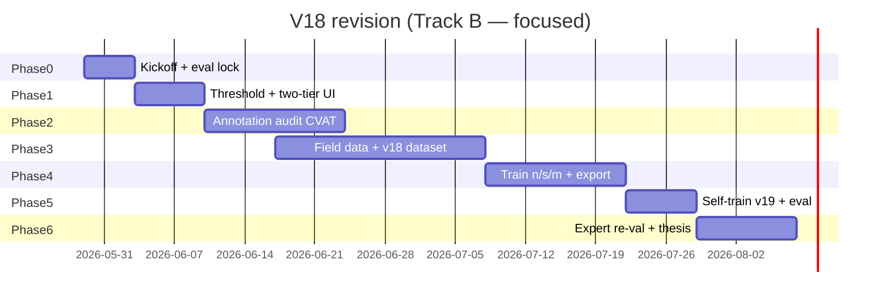

# V18 Panel Revision Plan — PINYA-PIC (Morga et al.)

*Detailed execution plan to address panel guidance **#1–#6** and move toward minimum deployability targets.*

**Created:** 2026-05-29  
**Baseline model:** `mealybug_v16_selffix`  
**Plan owner:** Proponents / ML lead  
**Status:** Phase 0 complete on Vast (2026-06-10); **v20s training in progress** — see `docs/training/V18_PIPELINE_STATUS.md`, `docs/V20_TRAINING_LOG.md`

---

## 1. Executive summary

The panel rated the project **technically promising but not deployment-ready**. Primary gaps: **recall (64.7%)**, **strict localization mAP@0.5:0.95 (40.7%)**, and **unsafe certainty in UX** (guidance #7–#8 already implemented in code/docs).

This plan is **data-first**: annotation quality and hard-case field images matter more than swapping YOLO variants. Threshold tuning improves **operational** recall but does **not** replace retraining for benchmark mAP.

### Already completed (guidance #7–#8)

| Item | Location |
|------|----------|
| Confusion-case export (TP/FP/FN/poor IoU) | `scripts/export_confusion_cases.py`, `docs/thesis/CONFUSION_CASES_V16.md` |
| Decision-support app messaging | `lib/data/detection_advisory_messages.dart` |
| Deploy threshold lowered to **0.25** | `lib/core/constants.dart` |

### Panel targets vs v16 baseline

| Metric | v16 (corrected test, conf 0.001, imgsz 1280) | Panel target | Gap |
|--------|-----------------------------------------------|--------------|-----|
| mAP@0.5 | **73.3%** | ≥ 85% | ~12 pp |
| Precision | **80.6%** | ≥ 80% | ✅ |
| Recall | **64.7%** | ≥ 80% | ~15 pp |
| mAP@0.5:0.95 | **40.7%** | ≥ 55–60% | ~15–20 pp |

**Realistic v18 outcome (if plan executed well):** mAP@0.5 **78–82%**, recall **72–78%**, mAP@0.5:0.95 **48–55%**. Hitting **all** panel targets requires the dedicated **`PLAN_TO_85_ALL_METRICS.md`** pipeline (v20 data + YOLO26m + label audit).

---

## 2. Timeline overview

**Plan start date:** 2026-05-29

| Track | Focus | Duration | Target finish |
|-------|--------|----------|---------------|
| **A — Full plan** | All phases below, typical capstone pace (~15–20 hr/wk) | **12–14 weeks** | **2026-09-05 – 2026-09-19** |
| **B — Focused full-time** | Same scope, 2–3 people dedicated | **8–10 weeks** | **2026-07-24 – 2026-08-07** |
| **C — Minimum revision** | Phases 0–2 + v18s only (skip n/m grid, limited collection) | **4–6 weeks** | **2026-07-03 – 2026-07-17** |

**Recommended for resubmission with credible improvement:** Track **B** or **C** depending on deadline.



---

## 3. Evaluation protocol (do not change mid-plan)

All v18 comparisons must use the **same** protocol as v16 headline numbers.

| Setting | Value | Notes |
|---------|-------|-------|
| Test split | `datasets/mealybug_v13afix/test` | 1,952 images |
| Ground truth | `test/labels_v16_corrected` | 18,891 instances |
| Benchmark conf | **0.001** | Full PR curve for mAP |
| Benchmark IoU | **0.6** | Same as V16_TRAINING_LOG |
| Train/eval imgsz | **1280** | Training and offline val |
| Deploy export | **640** and **960** TFLite | Compare before shipping |
| App deploy conf | **0.25** (+ optional 0.12–0.24 “check manually” tier) | Operational, not mAP |

**Regenerate headline plots:**

```powershell
cd D:\old_PINE
python scripts/eval_v16_corrected_test_plots.py --imgsz 1280
```

**Compare all v18 runs:**

```powershell
python scripts/compare_all_retrains.py
```

Document both **legacy** (~66%) and **corrected** test labels in thesis (transparency).

---

## 4. Roles (suggested)

| Role | Responsibility |
|------|----------------|
| **ML lead** | Training, eval, threshold sweep, export TFLite |
| **Annotation lead** | CVAT queues, boxing rules, pseudo-label review |
| **Field lead** | Photo collection, negatives, metadata (GPS/field) |
| **App lead** | Two-tier UI, APK rebuild, demo script |
| **Thesis lead** | Ch. IV updates, revision letter, panel response |

---

## Phase 0 — Kickoff & lock baseline (Week 0: May 29 – Jun 4)

**Goal:** Freeze v16 reference and open tracking.

### Tasks

- [x] **0.1** Copy v16 weights to archive: `runs/retrain/mealybug_v16_selffix/weights/best_v16_baseline_archive.pt`
- [ ] **0.2** Run corrected-test eval; save CSV/screenshots to `docs/thesis/assets/v18_baseline/` *(CPU slow — use `V18_PHASE0_RUN_ON_VAST.md`)*
- [ ] **0.3** Export confusion cases at scale:

```powershell
python scripts/export_confusion_cases.py --max-images 1952 --samples-per-class 8 --conf 0.25
```

- [ ] **0.4** Create CVAT project **“v18_audit”** — guide: `docs/training/V18_CVAT_AUDIT_SETUP.md`
- [x] **0.5** Write panel response letter draft: `docs/thesis/PANEL_REVISION_RESPONSE_DRAFT.md`
- [x] **0.6** Confirm GPU budget (Vast): ~**40–80 GPU-hours** — `docs/training/V18_PHASE0_RUN_ON_VAST.md`

### Deliverables

- `docs/thesis/assets/v18_baseline/v16_corrected_test_metrics.json`
- CVAT project ready
- Shared tracker (this doc’s checklists)

### Exit criteria

- v16 numbers reproduced within **±0.5 pp** mAP@0.5

---

## Phase 1 — Guidance #1: Recall & threshold (Week 1: Jun 3 – Jun 11)

**Goal:** Maximize **field** recall without claiming false certainty. Benchmark mAP unchanged.

### 1.1 Offline threshold sweep (v16 @ 1280, corrected test)

```powershell
python scripts/sweep_detection_threshold.py `
  --model runs/retrain/mealybug_v16_selffix/weights/best.pt `
  --data runs/calibration/data_v16_corrected_test.yaml `
  --deploy-focus `
  --imgsz 1280 `
  --out runs/calibration/threshold_sweep_v16_1280.json
```

*(Create `data_v16_corrected_test.yaml` if missing — copy from `scripts/eval_v16_corrected_test_plots.py`.)*

**Select operating points:**

| Tier | Target P/R band (panel) | Typical conf range |
|------|-------------------------|-------------------|
| Confirmed (count/save) | ~70–78% P, maximize R | **0.22–0.28** (current **0.25**) |
| Check manually (UI only) | Lower conf, dashed boxes | **0.12–0.21** |

- [ ] **1.2** Document chosen tiers in `docs/training/THRESHOLD_OPERATIONAL_TABLE.md` (v16 section)
- [ ] **1.3** Add thesis table: “Benchmark conf 0.001 vs deploy conf 0.25”

### 1.4 App: two-tier detection display (implementation)

| Constant | Suggested value | Purpose |
|----------|-----------------|--------|
| `detectionThreshold` | **0.25** | Confirmed boxes, count, severity |
| `manualCheckThreshold` | **0.12** | Amber dashed “inspect here” boxes |

Files to touch:

- `lib/core/constants.dart`
- `lib/utils/detection_tiers.dart`
- `lib/widgets/detection_overlay_image.dart` / `bounding_box_painter.dart`
- `lib/data/detection_advisory_messages.dart` (caption for amber tier)

- [ ] **1.5** Rebuild APK; add 30-second demo clip for panel

### Deliverables

- Threshold sweep JSON + P/R table
- App build with two-tier overlays
- 1 paragraph for thesis §3.3.2.1.5

### Exit criteria

- Operational recall at deploy conf improves vs 0.30 baseline (document in sweep table)
- No “healthy plant” messaging (already done)

---

## Phase 2 — Guidance #3: Annotation quality (Weeks 2–4: Jun 10 – Jun 28)

**Goal:** Fix label noise driving low recall and mAP@0.5:0.95. **Do not** repeat v17 SAM-tighten (failed — see `docs/V17_TRAINING_LOG.md`).

### 2.1 Build audit queue (automated)

Priority order:

1. **False negatives** — GT boxes with no pred @ conf 0.25  
2. **Poor localization** — matched IoU 0.50–0.75  
3. **False positives** — pred with no GT (white residue, glare)  
4. **High pseudo-label density** — images with many v16 self-train additions  

Scripts:

```powershell
python scripts/export_confusion_cases.py --max-images 1952 --samples-per-class 50
python scripts/audit_annotations.py --model runs/retrain/mealybug_v16_selffix/weights/best.pt
python scripts/find_bad_annotations.py
```

- [ ] **2.2** Export top **800–1000** images to CVAT (prioritize FN + poor IoU)

### 2.3 Manual review rules (`docs/data/BOXING_GUIDELINES.md`)

| Rule | Action |
|------|--------|
| One pest vs cluster | Pick **cluster = one box** OR **one insect = one box** — apply everywhere |
| Small pests | Box must include visible wax body; don’t skip specks |
| White dust / fungus | **No box** (true negative region) |
| Loose boxes | Tighten to reduce mAP@0.5:0.95 penalty |
| Empty images | **Empty `.txt`** required for negatives |

### 2.4 Review pseudo-labels from v16 self-train

- **+2,744** boxes added @ conf **0.50** before v16 train  
- [ ] Spot-check **300** images with highest box-add counts  
- [ ] Remove clear FP labels before merging into v18 train set  

### 2.5 SAM / DINO policy

| Tool | Use |
|------|-----|
| GroundingDINO | Suggest **missing** boxes only; human confirms |
| v16/v18 predictions | Self-train @ conf **≥ 0.45**, IoU dedup **0.30** |
| SAM tighten | **Do not use** (v17 regression) |

### Deliverables

- `datasets/mealybug_v18_audit/` — corrected labels for audited images  
- Audit log CSV: image, issue type, fix applied  
- Updated instance counts report  

### Exit criteria

- ≥ **800** images human-reviewed  
- Inter-annotator spot-check on **50** random images (≥ **90%** box agreement)  
- Expected label fixes: **+1,500–4,000** adjusted boxes, **−500–1,500** removed FP boxes  

### Expected metric impact (after retrain)

- mAP@0.5: **+5–12 pp**
- mAP@0.5:0.95: **+8–15 pp**
- Recall: **+5–10 pp**

---

## Phase 3 — Guidance #2: Hard-case data (Weeks 3–6: Jun 17 – Jul 12)

**Goal:** Add real field diversity; reduce memorization of easy Roboflow crops.

### 3.1 Finish in-progress batches

| Batch | Count | Status | Action |
|-------|------:|--------|--------|
| Field May 2025 | 510 | CVAT in progress | Complete review → merge |
| fix500 | 500 | Done | Already in v13afix |
| FOR VALIDATION | 139 | Holdout | **Expert re-val only — do not train** |

```powershell
.\scripts\field_day_from_drive.ps1 -AugmentAndMerge -Batch "field_batches\2026-05-21_..."
python scripts/build_v13afix_dataset.py --augment-field --fix-corrupt
```

### 3.2 New collection targets (minimum **1,500** new base photos)

Use `docs/data/FIELD_DAY_INGEST.md` workflow.

| Category | Min photos | Notes |
|----------|------------|-------|
| Early / light infestation | 300 | Panel priority |
| Small clusters, under leaf, crown | 400 | FN drivers |
| Blur / low light / flash | 200 | Phone realism |
| Wet / dusty / diseased leaf | 200 | FP drivers if mislabeled |
| True negatives (no mealybug) | 400 | Empty labels critical |
| Multiple varieties / growth stages | rest | Generalization |

- [ ] **3.3** Pre-label with v16 @ conf **0.12** for CVAT speed (`-MarkEmpty` for negatives)  
- [ ] **3.4** **2–3 field days** + team labeling sprints  

### 3.5 Build `mealybug_v18` dataset

- [ ] Merge: v16 train + audited fixes + field batch + new collection  
- [ ] Resplit **70/20/10** at **source-image** level (seed 42) — no aug leakage  
- [ ] Output: `datasets/mealybug_v18/` + `data.yaml`  
- [ ] Update `datasets/mealybug_v18/build_report.json` with image/box counts  

Target size (approximate):

| Split | Images | Instances |
|-------|-------:|----------:|
| Train | 15,000–17,000 | 115k–130k |
| Val | 3,900 | ~31k |
| Test | 1,952 | unchanged for comparability* |

\*Keep **same 1,952 test filenames** for v16→v18 comparison; only update labels if audit fixes test set (document transparently).

### Deliverables

- `datasets/mealybug_v18/data.yaml`  
- Field collection log (date, location, device, weather)  
- Thesis §3.x dataset paragraph update  

### Exit criteria

- ≥ **1,500** new base images labeled and merged  
- Test set unchanged or corrected with documented protocol  

### Expected metric impact

- mAP@0.5: **+4–8 pp**  
- Recall on field subset: **+10–15 pp**

---

## Phase 4 — Guidance #4, #5, #6: Train, augment, compare sizes (Weeks 6–8: Jul 8 – Jul 25)

**Goal:** Train best architecture on v18 data @ 1280; compare YOLO26n/s/m; pick export size.

### 4.1 Augmentation recipe (guidance #4)

**Enable (field-realistic):**

```yaml
hsv_h: 0.015
hsv_s: 0.5
hsv_v: 0.4
degrees: 10
translate: 0.1
scale: 0.5
fliplr: 0.5
mosaic: 1.0
close_mosaic: 10
blur: 0.01
```

**Disable / avoid:**

- `copy_paste` > 0 until labels verified (v17 lesson)  
- Extreme color jitter  
- Heavy mixup on tiny objects  

### 4.2 Training matrix (guidance #6 + #5)

Train all from **`yolo26*.pt`** on `datasets/mealybug_v18/data.yaml`, **imgsz=1280**:

| Run name | Weights | Batch | Epochs | Purpose |
|----------|---------|------:|-------:|---------|
| `mealybug_v18n` | yolo26n.pt | 24 | 120 | Mobile floor |
| `mealybug_v18s` | yolo26s.pt | 16 | 120 | Expected best balance |
| `mealybug_v18m` | yolo26m.pt | 8 | 100 | Max accuracy |

**Base command (Vast — adjust paths):**

```bash
yolo detect train \
  model=yolo26s.pt \
  data=/workspace/datasets/mealybug_v18/data.yaml \
  epochs=120 imgsz=1280 batch=16 \
  optimizer=AdamW lr0=0.001 lrf=0.01 cos_lr=True \
  warmup_epochs=3 patience=25 \
  iou=0.45 box=7.5 close_mosaic=10 dropout=0.1 \
  hsv_h=0.015 hsv_s=0.5 hsv_v=0.4 degrees=10 blur=0.01 \
  project=/workspace/runs/train name=mealybug_v18s \
  device=0,1
```

**Fine-tune variant (optional v18s_finetune from v16):**

```bash
yolo detect train \
  model=/workspace/runs/train/mealybug_v16_selffix/weights/best.pt \
  data=/workspace/datasets/mealybug_v18/data.yaml \
  lr0=0.0005 epochs=80 ...
```

- [ ] **4.3** Run `compare_all_retrains.py` on val + corrected test  
- [ ] **4.4** Pick winner by **mAP@0.5:0.95** first, then recall, then speed  

### 4.5 Export sizes (guidance #5)

For winning checkpoint:

```powershell
python scripts/retrain_yolo.py --export-only runs/retrain/mealybug_v18s/weights/best.pt --export-imgsz 640
python scripts/retrain_yolo.py --export-only runs/retrain/mealybug_v18s/weights/best.pt --export-imgsz 960
```

| Export | Measure on device |
|--------|-------------------|
| 640 TFLite | Latency ms, APK size |
| 960 TFLite | Latency ms, recall on small pests |

- [ ] **4.6** Choose export: prefer **960** if mid-range phone **< 400 ms** and recall gain **≥ 3 pp**  
- [ ] **4.7** Update `assets/model/best.tflite`, `AppConstants.inputSize`, `shippedModelId = mealybug_v18s`  

### Deliverables

- `docs/training/MODEL_COMPARISON_V18_NSM.md`  
- Training curves in `docs/thesis/assets/v18/`  
- Shipped TFLite + APK  

### Exit criteria

- Best v18 beats v16 on corrected test by **≥ 5 pp** mAP@0.5 **or** **≥ 8 pp** recall  
- Document n/s/m table in thesis  

---

## Phase 5 — Optional self-train v19 (Week 8: Jul 22 – Jul 28)

**Only if Phase 2 audit completed.** Same pattern as v15→v16.

```bash
# Predict on train @ conf 0.45, merge non-overlapping boxes (IoU dedup 0.30)
# Human-review sample of 200 added images
yolo detect train \
  model=/workspace/runs/train/mealybug_v18s/weights/best.pt \
  data=/workspace/datasets/mealybug_v18/data.yaml \
  lr0=0.0005 epochs=60 name=mealybug_v19_selffix
```

- [ ] Cap additions at **+3,000** boxes max without full re-audit  
- [ ] Re-eval on corrected test; ship v19 only if **strictly better** than v18 on recall **and** mAP@0.5:0.95  

---

## Phase 6 — Validation, thesis, panel package (Weeks 9–10: Jul 29 – Aug 11)

### 6.1 Benchmark report

- [ ] Corrected test metrics table (v16 vs v18 vs v19)  
- [ ] Threshold operational table @ 1280  
- [ ] Updated confusion-case figure (16 crops minimum)  
- [ ] Regenerate panel graphs: `python scripts/plot_v16_panel_graphs.py` (adapt for v18)  

### 6.2 Expert field re-validation

Expand beyond n=21:

| Design | Value |
|--------|-------|
| Images | **≥ 50** (mix positive/negative/hard) |
| Validators | 2–3 (OMA or entomology) |
| Threshold | **0.25** deploy (same as app) |
| Metrics | P, R, F1, Jaccard — **not** mAP |

- [ ] Blind protocol: validators do not see model boxes first  
- [ ] Compare v16 vs v18 if time permits  

### 6.3 Thesis & revision letter

Update:

- Abstract / §1.3 objectives (prototype framing)  
- §3 dataset (v18 counts)  
- §4.1 model performance (new tables)  
- §4.x limitations (honest gap vs 85% target)  
- §5 conclusion — “minimum deployable under continued validation”  
- `docs/thesis/REVISION_LIST_WITH_EXPLANATIONS.md`  
- Panel response mapping table (guidance #1–8 → evidence)  

### 6.4 Demo checklist

- [ ] APK with v18 TFLite + two-tier UI + advisory messages  
- [ ] 3–5 min video: hard case, negative scan, positive with “verify visually”  
- [ ] Slide: “What we did not claim” (not a diagnosis)  

### Exit criteria (project “finished” for resubmission)

- [ ] v18 eval complete with documented protocol  
- [ ] Expert re-val ≥ 50 images  
- [ ] Thesis Ch. IV + revision letter submitted  
- [ ] Demo APK matches thesis model ID and threshold  

---

## 5. Minimum revision path (Track C — 4–6 weeks)

If deadline is **mid-July 2026**, cut scope:

| Keep | Skip/defer |
|------|------------|
| Phase 0–2 (audit 500 images) | Full 1000-image audit |
| Merge 510 field batch | Large new collection (do 500 min) |
| Train **v18s only** @ 1280 | n/m comparison grid |
| Export 640 only (or 960 if quick win) | v19 self-train |
| Expert re-val **30** images | 50+ images |
| Thesis + APK update | Second field season |

**Track C target finish:** **2026-07-03 – 2026-07-17**

---

## 6. Risk register

| Risk | Impact | Mitigation |
|------|--------|------------|
| CVAT backlog | Delays everything | Start Phase 2 Week 1; 3 reviewers in parallel |
| Field weather / access | Missing hard cases | Use existing 510 batch + Roboflow hard subset |
| v18m OOM on GPU | No m checkpoint | batch=4, single GPU, or skip m |
| Self-train FP pollution | Worse model | Human review gate; conf ≥ 0.45 only |
| 960 TFLite too slow | Bad demo | Keep 640; enable Accuracy tiling |
| Panel expects 85% mAP | Perceived failure | Report trajectory + operational F1; prototype framing |
| Test label correction debate | Credibility | Report legacy + corrected side by side |

---

## 7. Success criteria (tiered)

### Tier 1 — Resubmission acceptable

- [ ] Recall **≥ 72%** on corrected test (or **≥ 78%** operational @ 0.25)  
- [ ] mAP@0.5 **≥ 78%**  
- [ ] Guidance #7–#8 in thesis + app  
- [ ] Expert re-val **≥ 30** images with documented protocol  

### Tier 2 — Panel “minimum deployable” aspirational

- [ ] Recall **≥ 80%**  
- [ ] mAP@0.5 **≥ 85%**  
- [ ] mAP@0.5:0.95 **≥ 55%**  
- [ ] Expert re-val **≥ 50** images  

### Tier 3 — Strong capstone

- Tier 2 + two-tier UI + v18s/v18m ablation in thesis + field pilot notes  

---

## 8. Master checklist (copy to weekly standup)

### Week-by-week

| Week | Dates | Must complete |
|------|-------|---------------|
| 0 | May 29 – Jun 4 | Phase 0 |
| 1 | Jun 3 – Jun 11 | Phase 1 |
| 2–3 | Jun 10 – Jun 25 | Phase 2 (audit ≥ 400 imgs) |
| 4–5 | Jun 24 – Jul 9 | Phase 3 (field merge) |
| 6–7 | Jul 8 – Jul 22 | Phase 4 (v18 train + export) |
| 8 | Jul 22 – Jul 28 | Phase 5 (optional v19) |
| 9–10 | Jul 29 – Aug 11 | Phase 6 (thesis + re-val) |

### Guidance mapping

| Panel # | Topic | Phase | Done? |
|---------|-------|-------|-------|
| 1 | Recall / threshold | 1 | ⬜ |
| 2 | Hard-case images | 3 | ⬜ |
| 3 | Annotation quality | 2 | ⬜ |
| 4 | Augmentation | 4 | ⬜ |
| 5 | Train/export size | 4 | ⬜ |
| 6 | YOLO26n/s/m compare | 4 | ⬜ |
| 7 | Confusion cases | 0 (done) | ✅ |
| 8 | Advisory UX | done | ✅ |

---

## 9. Key file reference

| Purpose | Path |
|---------|------|
| App threshold | `lib/core/constants.dart` |
| Advisory copy | `lib/data/detection_advisory_messages.dart` |
| Confusion export | `scripts/export_confusion_cases.py` |
| Threshold sweep | `scripts/sweep_detection_threshold.py` |
| Dataset build | `scripts/build_v13afix_dataset.py` |
| Field ingest | `docs/data/FIELD_DAY_INGEST.md` |
| Boxing rules | `docs/data/BOXING_GUIDELINES.md` |
| Train/export | `scripts/retrain_yolo.py` |
| Model compare | `scripts/compare_all_retrains.py` |
| v16 baseline log | `docs/V16_TRAINING_LOG.md` |
| Revision list | `docs/thesis/REVISION_LIST_WITH_EXPLANATIONS.md` |
| Confusion thesis | `docs/thesis/CONFUSION_CASES_V16.md` |

---

## 10. Panel response paragraph (template)

> Following the panel’s recommendation for major revision, we repositioned PINYA-PIC as a **decision-support prototype** rather than a standalone diagnostic tool. We implemented safer advisory messaging and qualitative error analysis (Guidance #7–#8), lowered the operational threshold to **0.25**, and executed a **data-first v18 cycle**: manual annotation audit on failure cases, integration of **510+** field images, YOLO26 **n/s/m** comparison at **1280px** training resolution, and expert re-validation at the deploy threshold. We report corrected-test metrics transparently alongside legacy labels and do not claim field-ready deployment until recall, strict localization mAP, and expanded expert validation meet the agreed minimum targets.

---

*Update this document at the end of each phase. Log actual dates and metric deltas in `docs/training/V18_PROGRESS_LOG.md` (create on Phase 0 completion).*
